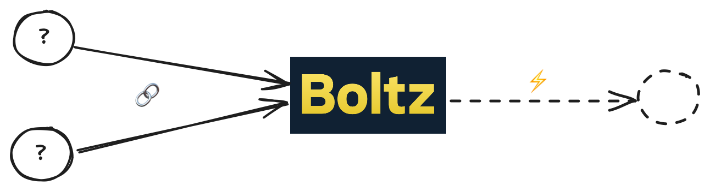

[Boltz](https://boltz.exchange) is a non-custodial bridge that allows users to
trustlessly pay a Lightning invoice with an on-chain payment, via
[Submarine Swap](https://www.voltage.cloud/blog/submarine-swaps-how-do-they-work-and-where-they-are-used).

As a result, the on-chain Boltz wallet ends up accumulating many small UTXOs that
must be routinely managed and consolidated to avoid high transaction fees.

## Enter Payjoin

Payjoin enables the Boltz receiver wallet to add its own input(s) to an incoming
Submarine Swap transaction, thus consolidating UTXOs at the time of payment.

The sender pays the transaction fee for this consolidation, and gets better
privacy in return. An outside observer can't know with certainty which input
belongs to the customer vs. which belong to Boltz, and the resulting
consolidation obfuscates the payment amount. Such a transaction also breaks the
[common-input heuristic](https://en.bitcoin.it/wiki/Common-input-ownership_heuristic),
weakening the assumption that all inputs in a transaction belong to the same
sender and providing much better privacy properties to every participant in the
Bitcoin network.

## Proof of concept

For the MIT Bitcoin hackathon, the Payjoin team implemented a proof of concept
by integrating the Payjoin Dev Kit into the
[Boltz Backend](https://github.com/DanGould/boltz-backend).

<video width="100%" controls><source src="../assets/boltz-payjoin.mp4">No video support.</video>

This demo in the span of a 30 hour hackathon alongside
[two](https://x.com/payjoindevkit/status/1909667705730269274)
[other](https://github.com/thebrandonlucas/interactive-payjoin)
POC integrations.
This achievement highlights how far PDK has come in making Payjoin accessible
and ergonomic for developers to use.

## Next Steps

Together, these POCs represent an early vision of a future where Payjoin is
widely supported and easy to implement. The first step is to get this integration
production-ready and well-tested. Progress on this work can be tracked on
[this Boltz PR](https://github.com/BoltzExchange/boltz-backend/pull/892).
